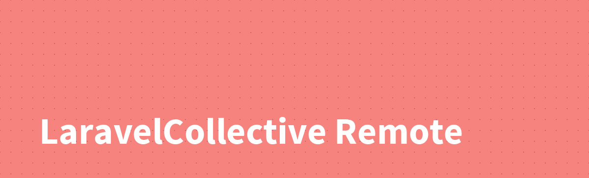

Official documentation for Remote (SSH) for The Laravel Framework can be found at the [LaravelCollective](http://laravelcollective.com) website.

## This package is abandoned

Use the drop-in replacement for this package with support for PHP 8.x and Laravel 10.x: [Laravel SSH](https://github.com/rocketeers-app/laravel-ssh)
